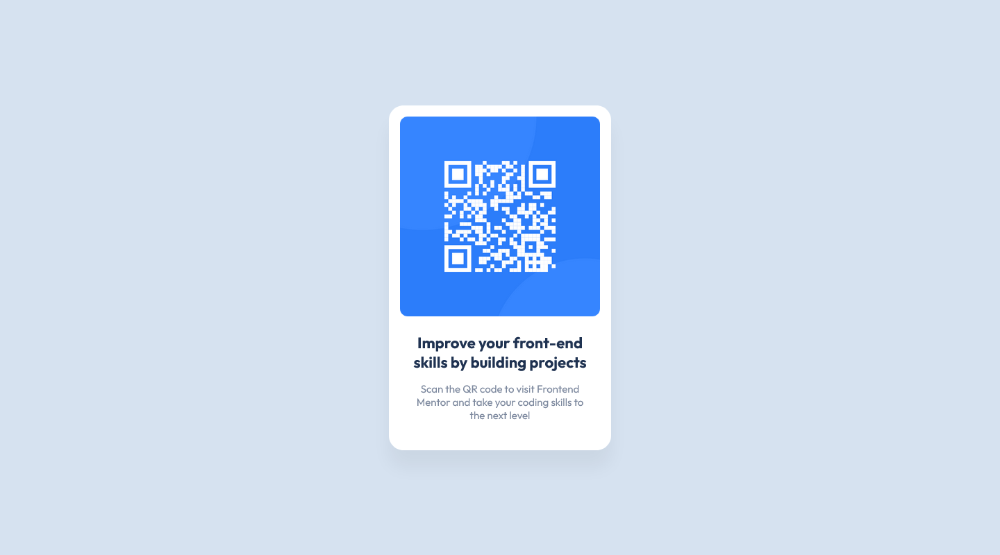

# Frontend Mentor - QR code component solution

This is a solution to the [QR code component challenge on Frontend Mentor](https://www.frontendmentor.io/challenges/qr-code-component-iux_sIO_H). Frontend Mentor challenges help you improve your coding skills by building realistic projects. 

## Table of contents

- [Screenshot](#screenshot)
- [Links](#links)
- [Built with](#built-with)
- [Author](#author)

### Screenshot

### Links

- Solution URL: [FrontEndMentor](https://www.frontendmentor.io/solutions/qrcode-2-6OcsjuB_hH)
- Live Site URL: [Netlify](https://precious-cat-f800e3.netlify.app/)

### Built with

- HTML & CSS (With Flexbox).

## Author

- Frontend Mentor - [@Alexioos95](https://www.frontendmentor.io/profile/Alexioos95)
- LinkedIn - [AlexisPayen](https://www.linkedin.com/in/alexispayen/)
